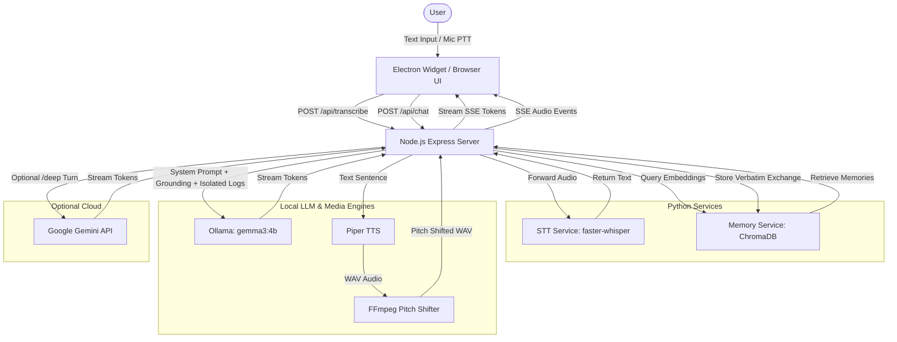

# My Council — Codebase Analysis

**My Council** is a local-first desktop AI companion application. It allows users to chat with six distinct anime and gaming character personas (collectively **the Council**) who share a single long-term memory pool and reside in a transparent, frameless desktop avatar widget. The project runs completely locally, utilizing Gemma 3 4B via Ollama for text generation, ChromaDB for memory, faster-whisper for speech-to-text (STT), and Piper for text-to-speech (TTS), with an optional hybrid cloud toggle (`/deep`) for Google Gemini.

---

## 1. System Architecture

The following diagram illustrates the data flow and integration of the four processes during a single chat turn:



---

## 2. Core Service Components

The application divides its logic into four main layers:

### 2.1. Desktop Widget Shell (Electron & Frontend)
- **Frameless Container ([main.js](file:///D:/my-council/main.js)):** Configures Electron to load `http://localhost:3000` inside a transparent, frameless, always-on-top window. It performs a port-binding check: if port `3000` is free, it spawns the Node.js backend in-process; otherwise, it hooks into an already running instance.
- **Frontend Controller ([public/app.js](file:///D:/my-council/public/app.js)):** Orchestrates the UI layout, streams chat text from Server-Sent Events (SSE), and handles persona switching. 
- **Aesthetics & Widget Control ([public/styles.css](file:///D:/my-council/public/styles.css)):** Implements the transparent glassmorphism layout, drag-to-move behaviour, and a slide-out drawer (click `💬` to toggle collapse/expand).
- **Avatar Management ([public/avatar.js](file:///D:/my-council/public/avatar.js)):** Swaps per-persona assets by state with a quick opacity transition — static `<id>.png` when idle, `<id>-thinking.gif` while generating, `<id>-talking.gif` while TTS audio plays (plus emotion poses), with a fallback cascade to the base PNG. CSS adds a contour-glow pulse per state (generating, deep query, speaking).
- **Voice Manager ([public/voice.js](file:///D:/my-council/public/voice.js)):** Receives sentence-by-sentence audio paths from SSE, queueing and playing them sequentially via the browser's audio element. Includes a mute toggle button, and syncs speaking state to the avatar and mic managers.
- **Voice-activation STT ([public/mic.js](file:///D:/my-council/public/mic.js)):** Click-to-toggle the mic on/off (not hold-to-talk). While listening it monitors RMS volume via the Web Audio API and auto-stops after a silence window once speech is detected, then uploads the recorded clip to `/api/transcribe` and submits the transcript. In always-on mode it resumes listening after the persona finishes speaking.

### 2.2. Web & Coordination Server (Node.js/Express)
- **Server Entrypoint ([server/index.js](file:///D:/my-council/server/index.js)):** Exposes Express routes `/api/personas`, `/api/tts` (serving synthesized WAVs), `/api/transcribe` (proxy to python STT), and `/api/chat` (streaming event-stream). Binds to `127.0.0.1` only (loopback), so the app is never reachable from the local network — matching how the Python services bind.
- **Central Config ([server/config.js](file:///D:/my-council/server/config.js)):** Consolidated configuration mapping ports, URLs, models, features (TTS, STT, memory, cloud), and per-persona voice tuning.
- **Ollama Client ([server/ollama.js](file:///D:/my-council/server/ollama.js)):** Streams chat completions from Ollama. Restrained to 4k context to fit inside the GTX 1650's 4GB VRAM.
- **Gemini Cloud Gateway ([server/cloud.js](file:///D:/my-council/server/cloud.js)):** Streams completions from Google's official Gemini free tier. Triggered using the `/deep` prefix.

### 2.3. Shared Memory Engine (Python & ChromaDB)
- **FastAPI Wrapper ([memory-service/app.py](file:///D:/my-council/memory-service/app.py)):** Exposes endpoints `/health`, `/store`, and `/retrieve`. Loads ChromaDB `PersistentClient` and ONNX CPU-based `all-MiniLM-L6-v2` embeddings once at startup to keep memory latency low.
- **Fact Filtering Heuristics ([memory-service/quality.py](file:///D:/my-council/memory-service/quality.py)):** Filters low-value inputs (greetings or deflections like *"I do not know"*) out of the database to prevent retrieval pollution.
- **Node-Side Client ([server/memory.js](file:///D:/my-council/server/memory.js)):** Communicates with the Python service over localhost. It filters out greetings and enforces a strict semantic distance threshold of `0.7` (cosine similarity) to drop irrelevant context.

### 2.4. Speech-to-Text Engine (Python & faster-whisper)
- **FastAPI Wrapper ([stt-service/app.py](file:///D:/my-council/stt-service/app.py)):** Exposes `/health` and `/transcribe`. It uses `faster-whisper` (default model `base`, running on CPU in INT8 precision) to transcribe uploaded audio clips without competing for GPU VRAM.

---

## 3. Prompt Engineering & Context Design

To maintain character consistency and prevent the local LLM from breaking the illusion, [server/context.js](file:///D:/my-council/server/context.js) formats every prompt using three strict rules:

1. **Context Isolation (Voice Leak Guard):**
   - The LLM's assistant role is reserved *exclusively* for the active persona's prior replies.
   - Other Council members' replies in the current session are isolated. They are flat-formatted into an `[OBSERVED HISTORY]` block inside the `system` instructions. This allows the active persona to know what was said without copying another persona's voice or prefixing replies.
2. **Attributed Memory Logs:**
   - Vector memories are formatted in `[DATABASE MEMORY LOGS]`.
   - For memories where the active persona replied, both user message and reply are shown verbatim.
   - For memories belonging to *other* personas, only the user's message is shown (with a note that the other member responded), preventing the LLM from copying another member's signature phrasing.
3. **Factual Grounding Anchor:**
   - Injects a `[GROUNDING]` block instructing the LLM that it knows nothing about the user beyond the current turn and injected memories, forcing it to state honestly if it does not know a fact.

---

## 4. Voice-First Audio Pipeline

To prepare output for TTS and voice playback, the server uses a multi-layered sanitization pipeline:

```
[Raw Streamed LLM Token]
           │
           ▼
[Reply Filter Buffer] (reconciles unclosed *actions* or (stage directions))
           │
           ▼
[Spoken Dialogue Text Only] (max 4 sentences, no asterisks, no quotes, no labels)
           │
           ▼
[Sentence Splitter] (splits via lookbehind so decimals like "3.14" do not break)
           │
           ▼
[Piper TTS Synthesizer] (runs on CPU per sentence using .onnx voice models)
           │
           ▼
[FFmpeg Pitch Shifter] (shifts pitch down for Kratos/Vergil without altering speed)
           │
           ▼
[Audio SSE Frame] (emits url link to GET /api/tts?id=...&seq=...)
```

- **Streaming Token Sanitizer ([server/reply-filter.js](file:///D:/my-council/server/reply-filter.js)):** Restricts output to voice-only. It strips stage directions, actions, double quotes, and asterisks. It caps sentences to 4, holding back unclosed brackets/stars mid-stream to avoid taking back streamed content.
- **TTS Synthesis ([server/tts.js](file:///D:/my-council/server/tts.js)):** Synthesizes sentences asynchronously.
- **FFmpeg Post-processing ([server/tts.js](file:///D:/my-council/server/tts.js)):** Shifts sample rate (`asetrate`) and duration (`atempo`) dynamically to pitch-shift the voice down (creating Kratos's gravelly tone) or up (creating Anya's child-like tone).
- **Audio Pre-warming ([server/tts.js](file:///D:/my-council/server/tts.js)):** Synthesizes a throwaway phrase (*"Ready."*) for the default persona at server boot to cache the voice model in OS RAM, avoiding a startup delay on the first user query.

---

## 5. Persona Registry & Voice Tuning

The active personas are defined in JS files inside `server/personas/` and registered in [server/personas/index.js](file:///D:/my-council/server/personas/index.js). The TTS configuration in [server/config.js](file:///D:/my-council/server/config.js) details their custom voices:

| Persona ID | Display Name | Voice Model (ONNX) | Speed (`length_scale`) | Expressiveness (`noise_scale`) | Pitch Shift (`pitch`) | Vibe Description |
| :--- | :--- | :--- | :--- | :--- | :--- | :--- |
| **kratos** | Kratos | `en_GB-alan-medium.onnx` | `1.30` (Very slow) | `0.60` | `0.82` (Deepened) | Stern, blunt warrior, British accent, low register. |
| **vergil** | Vergil | `en_US-ryan-medium.onnx` | `1.15` (Slow) | `0.40` (Flat) | `0.95` (Slightly deep) | Cold strategist, American accent, measured. |
| **dante** | Dante | `en_US-joe-medium.onnx` | `0.95` (Fast) | `0.70` (Expressive) | `1.05` (Slightly high) | Cocky fighter, playful, energetic. |
| **naruto** | Naruto | `en_US-bryce-medium.onnx` | `0.90` (Very fast) | `0.70` (Expressive) | `1.12` (Youthful) | Optimistic, hyperactive, high energy. |
| **jiraiya** | Jiraiya | `en_US-norman-medium.onnx` | `1.10` (Measured) | `0.667` | `0.92` (Deepened) | Wise mentor, warm, philosophical weight. |
| **anya** | Anya | `en_US-amy-medium.onnx` | `0.95` (Fast) | `0.70` | `1.30` (High child) | Playful caretaker, curious, high pitch. |

---

## 6. Security, Safety & Soft Degradation

1. **Fail-Soft Services:**
   - If the memory service is offline, queries log warnings and skip retrieval/storage. The app continues with in-session chat, displaying a helpful notice block.
   - If the STT or TTS service is offline/unconfigured, the backend falls back to text-only mode without crashing the server or interrupting user input.
2. **Loopback-Only Binding:**
   - The Node app server binds explicitly to `127.0.0.1` ([server/index.js](file:///D:/my-council/server/index.js)), not `0.0.0.0`, so it is reachable only from the local machine. This keeps the private shared memory and the Gemini-key-spending `/deep` path off the local network, matching the `127.0.0.1` binding the Python memory and STT services already use.
3. **Defensive Endpoint Design:**
   - The `/api/tts` route validates the requested `id` (via regex) and checks the in-memory registry map to confirm the file exists in the temp directory. This eliminates any path-traversal vulnerability.
   - Piper execution uses Node's `execFile` without shell interpolation, and the user-supplied text is fed into the process's standard input (`stdin`), preventing command injection.
4. **API Key Safety:**
   - The Gemini API key is loaded strictly from the process environment (`GEMINI_API_KEY`) or `.env`. The gateway URL is hardcoded to Google's official Generative Language API, preventing key exfiltration.
